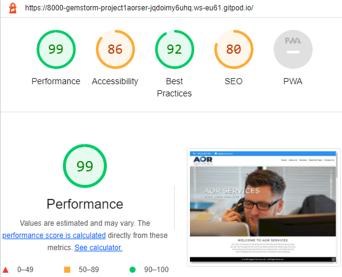

Welcome to the redevelopment of AOR Services - a commercial WordPress website converted to a static HTML/CSS/JS website as part of the Code Institute Full Stack Developer Course. This is Milestone Project 1 for John C. for submission in August 2022 through Code Institute.

# Table of Contents
* [Introduction](https://github.com/Gemstorm/Project-1-AOR-Services#introduction)
* [User Experience Design](#user-experience-design)  
  * [Site Visitors / Customers](https://github.com/Gemstorm/Project-1-AOR-Services#user-stories)
  * [Structure](https://github.com/Gemstorm/Project-1-AOR-Services#structure)
  * [Design](https://github.com/Gemstorm/Project-1-AOR-Services#design)
    * [Colors](https://github.com/Gemstorm/Project-1-AOR-Services#colors)
    * [Typography](https://github.com/Gemstorm/Project-1-AOR-Services#typography)
    * [Images](https://github.com/Gemstorm/Project-1-AOR-Services#images)
    * [Wireframes](https://github.com/Gemstorm/Project-1-AOR-Services#wireframes)
    * [Design Deviations](https://github.com/Gemstorm/Project-1-AOR-Services#design-deviations)
  * [Limitations](https://github.com/Gemstorm/Project-1-AOR-Services#limitations)
* [Features](https://github.com/Gemstorm/Project-1-AOR-Services#features)
  * [Current Features](https://github.com/Gemstorm/Project-1-AOR-Services#current-features)
  * [Future Features](https://github.com/Gemstorm/Project-1-AOR-Services#future-features)
* [Technologies](https://github.com/Gemstorm/Project-1-AOR-Services#technologies)
  * [Languages](https://github.com/Gemstorm/Project-1-AOR-Services#languages)
  * [Libraries, Frameworks & Programs Used](https://github.com/Gemstorm/Project-1-AOR-Services#libraries-frameworks--programs-used)
* [Testing](https://github.com/Gemstorm/Project-1-AOR-Services#testing)
  * [Validation](https://github.com/Gemstorm/Project-1-AOR-Services#validation)
    * [HTML Validation](https://github.com/Gemstorm/Project-1-AOR-Services#html-validation)
    * [CSS Validation](https://github.com/Gemstorm/Project-1-AOR-Services#css-validation)
  * [User Scenarios - Testing](https://github.com/Gemstorm/Project-1-AOR-Services#user-scenarios---testing)
    * [First Time User](https://github.com/Gemstorm/Project-1-AOR-Services#first-time-user)
    * [Returning User](https://github.com/Gemstorm/Project-1-AOR-Services#returning-user)
    * [Frequent User](https://github.com/Gemstorm/Project-1-AOR-Services#frequent-user)
  * [Known Bugs](https://github.com/Gemstorm/Project-1-AOR-Services#known-bugs)
  * [Lighthouse Results](https://github.com/Gemstorm/Project-1-AOR-Services#lighthouse-results)
    * [Performance](https://github.com/Gemstorm/Project-1-AOR-Services#performance)
    * [Accessibility](https://github.com/Gemstorm/Project-1-AOR-Services#accessibility)
* [Deployment](https://github.com/Gemstorm/Project-1-AOR-Services#deployment)
   * [Project Creation](https://github.com/Gemstorm/Project-1-AOR-Services#project-creation)
   * [Publishing](https://github.com/Gemstorm/Project-1-AOR-Services#publishing)
   * [Local Clone](https://github.com/Gemstorm/Project-1-AOR-Services#local-clone)
* [Acknowledgements](https://github.com/Gemstorm/Project-1-AOR-Services#acknowledgements)
  * [Code](https://github.com/Gemstorm/Project-1-AOR-Services#code)
  * [Media](https://github.com/Gemstorm/Project-1-AOR-Services#media)

You can find the published website here: [Project 1: AOR Services](https://github.com/Gemstorm/Project-1-AOR-Services/index.html).
# Introduction

The project is part of a Full Stack Developer course run by CodeInstitute. This is Milestone Project 1. This project was to create a website for a local, family run gym that is looking to reach out to new potential members in order to encourage more visits and memberships.

## AOR Services Responsive Website

A mockup of the website can be seen below:

# User Experience Design
## Site Visitors / Customers
* A first time visitor would expect to see what business services are offered by AOR Services?
  1. Visitors expect to find more information related to insurance claims and loss assessing
  2. How to contact the company.
  3. Who they are dealing with: what level of expertise and knowledge.
  4. Are there any other services on site that could help.
  6. The ability to navigate around the website easily and find information.
  7. Does the site work as expected on a mobile phone and on a desktop.
## Structure
It is intended that the design of the website will meet the visitors expectation namely:
* A device responsive navigation bar is supplied to the top of the page.
> Intuitive navigation helps the visitor to find information that is important.
* The home page is the initial point of contact for all visitors (with the exception of bookmarked pages which is in the minoirty). A smart homoe page supplies all the relevant information on one page and does not require the visitor to click away from the page. They can simply scroll to get access to more and more information.
> The contact section allows for enquiries from visitors and the visible placing of the company phone number and email address re-inforces this.
* The home page contains sections outlining current services and a company profile section where key staff are introduced.
* The page finishes with General Contact Information including the business adddress and required legal information from the regulatory authorities.
* The Contact form also contains an interactive Google Map showing the business's location.
* The company currently does not have any social media accounts but if launched, it is intended that the fixed footer which finishes off the Home Page would be updated as required.

## Design
### Colors
The main colors for the website are a royal blue (#3399FF), white (#FFFFFF) and black (#oooo).
### Typography
THere are 2 site fonts, drawn from Google Fonts: **Montserrat** and **Inconsolata** font.
### Images
The logo was created by the WordPress Developer company called Conker which is no longer in existence. Having the logo visible on all devices is key to the branding of the company. The logo does disappear when the viewport is between 750 and 650 pixels wide - it was felt that displaying the menu in full as long as possible was more important. The logo is shown on all remaining viewports on the left hand side of the navigation bar.
### Wireframes
Wireframes images can be seen below and also found in the "/assets/readme-assets" folder. It contains a design for the desktop and mobile version of the website.

* Home Page 1:   
* Home Page 2:   
* Services Page:   
* Contact Us Page:   

### Design Deviations
The originbal wireframe design had multiple pages but this was changed to a one page design which was more efficient and reduces the need for visitors to click through to different pages. Simple scrolling will reveal all the company information keeping customer interaction at optimal levels.

## Limitations
Currently there some limitations of the website. As shown below:
* The contact form currently pass information to the form testing URL of Code Institute: https://formdump.codeinstitute.net/.

# Features
## Current Features
Some of the key features incorporated into the website include responsiveness for multiple screen sizes and orientations. Originally a fixed top navigation bar was installed for easy navigation between the page sections and the content. However, upon consultation with the business owner, it was felt that the real estate used for this was too much and it was reverted to simple navigation bar. The menu bar resizes automatically for smaller screen sizes.

## Future Features
Features that could be released in subsequent versions include:
* Enquires being sent straight to personal trainers instead of a general inbox.
* An online shop for products, or a page to highlight current products and special offers.
* A booking system to reserve space in classes.

# Technologies
Technologies used are as follows.
## Languages
* [HTML5](https://en.wikipedia.org/wiki/HTML5)
  * Used as the main language to code the website.
* [CSS3](https://en.wikipedia.org/wiki/CSS)
  * Used to incorporate custom styling into the website.

## Libraries, Frameworks & Programs Used
1. [Balsamiq](https://balsamiq.com/)
   * Used to create the initial wireframe design.
2. [Font Awesome](https://fontawesome.com/)
   * Used for all the icons throughout the website. 
3. [Google Fonts](https://fonts.google.com/)
   * Imported font "Monterrat" and by Julieta Ulanovsky, Sol Matas, Juan Pablo del Peral, Jacques Le Bailly.
   * Imported font "Inconsolata" by Raph Levien.
4. [GitHub](https://github.com/)
   * Storage for AOR website's content, code and assets (images, CSS, videos and JS files).
5. [GitPod](https://www.gitpod.io/)
   * An online IDE used to test the code and push it to the GitHub repository.
6. [Chrome Dev Tools](https://developer.chrome.com/docs/devtools/)
   * A developer debugging tool Used to examine and test CSS styles in the browser.
7. [W3 Schools](https://www.w3schools.com/default.asp)
   * A learning and training website for multiple languages including CSS.

# Testing

This is a simple Point of Presence website and code testing is limited to the contact form - which can be completed and submitted. It will receive the appropriate response from the Code Institute formdump testing system. Testing is limited to the visual aspect of the website anmely the responsiveness of the site which was tested across 3 different browsers and simulating responsiveness on each, varying screen sizes will be simulated, ranging from a minimum width of 300px to a maximum width of 3000px:
  * Google Chrome
  * Microsoft Edge
  * Brave
* No layout items in the containers overlapping other layout items.
* Links in the navigation bar to take the user to the correct section.
* External links to open in a new tab.
* Contact form to require an input in each field prior to submission.
* Buttons have a colour change and an underline with a hover effect.

## Validation
### HTML Validation
"index.html" was run through the [W3C HTML Validator](https://validator.w3.org/), via the direct input method. Errors regarding use of spaces in email addresses and a dupliation of the site-logo div. Both of these issues were corrected and the validator now returns a clean bill of health at time of writing.
### CSS Validation
CSS Stylesheet was run through the [W3C CSS Validator](https://jigsaw.w3.org/css-validator/), via the direct input method and no errors were found.

## Lighthouse
Lighthouse Results for performance returns a 99 as seen below:

Initially a lower performance score was issued due to large size images but these were resized and compressed using Microsoft Image Composer and the significantly improved the performance score.

## Known Bugs
1. The site logo moves down the page when scrolling - this is an unpalnned feature that promotes the branding of the site but there are several sections of the website where this does not display properly.
   * This is still to be corrected.
3. Navigation bar "hamburger" menu is not displaying  proerpky as the menu items are underneath the main site image. A temproary hack has been placed to resolve this.

# Deployment
## Project Creation
To create the project, firstly a Chrome extension called "[Gitpod - Always ready to code](https://chrome.google.com/webstore/detail/gitpod-always-ready-to-co/dodmmooeoklaejobgleioelladacbeki?hl=en-GB)" was installed. A CodeInstitute template was use by navigating to the [GitHub Repo](https://github.com/Code-Institute-Org/gitpod-full-template) and clicking the "Use this template" button. The repository was called "Project-1-AOR-Services", and project folders and files were generated.

Common Git commands were used as follows:
* git add "filename-here" - used to stage files before commiting them.
* git commit -m "message here" - used to commit changes to the local repositry, with the message containing information on the changes that have occured.
* git status - used to check the tracking status of the file in the project.
* git push - used to push the changes to the GitHub repository.

## Publishing
To publish the project following steps were followed:
1. Navigated to the project's [Github page](https://github.com/Gemstorm/Project-1-AOR-Services).
2. Clicked on the "Settings" button.
3. Clicked on the "Pages" button.
4. Under the "Source" heading, changed the "Branch" setting from "None" to "Main", then clicked save.
5. This gave a link to the [published website](https://gemstorm.github.io/Project-1-AOR-Services/).

## Local Clone
To create a local clone of the project you can follow the steps below:
1. Navigate to the project's [Github page](https://github.com/Gemstorm/Project-1-AOR-Services).
2. Click the "Code" dropdown button.
3. From here there are two options:
     * Option 1: Click the "Download ZIP" button to download the files. This can be unzipped locally and opened with your preferred IDE.
     * Option 2: Copy the link from the HTTPS box shown. Then open your preferred IDE of choice and in the terminal window of your preferred directory, use the command "git clone" followed by the link that was copied. For example "git clone https://github.com/Gemstorm/Project-1-AOR-Services.git". This will clone the files in the selected directory.

# Acknowledgements
Thank you Mr. Spencer Barriball for his help and guidance with all the tricky bits :) Legend!

## Media
All Images and Logos courtesy of AOR Services and and [Unsplash](https://unsplash.com/).
All videos courtesy of and the video from [Coverr](https://coverr.co) and [MixKit](https://mixkit.co).

* "AlanORaffertyHelp.jpg" photo by [Berkeley Communication](https://unsplash.com/@berkeleycommunications)
* "AlanORaffertyAbout.jpg" photo by [Scott Graham](https://unsplash.com/@scottgraham)

* All other images are the property of AOR Services and were commissioned and developed by Conker (no longer trading).

Thank you.

